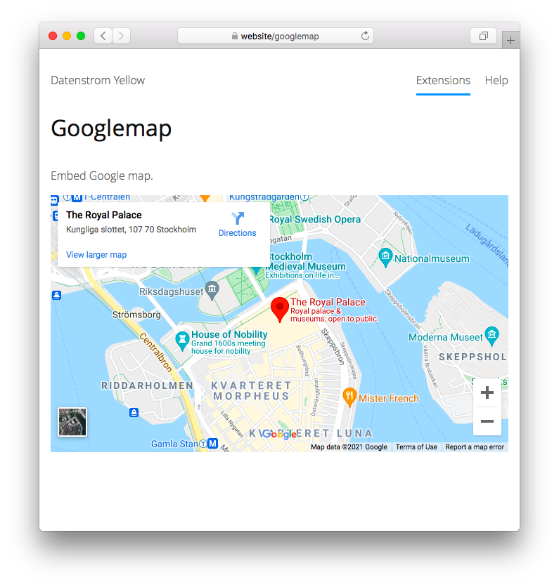

<a href="README-de.md">Deutsch</a> &nbsp; <a href="README.md">English</a> &nbsp; <a href="README-sv.md">Svenska</a>

# Googlemap 0.9.1

Google-Karte einbinden.

## Wie man eine Erweiterung installiert

[ZIP-Datei herunterladen](https://github.com/annaesvensson/yellow-googlemap/archive/refs/heads/main.zip) und in dein `system/extensions`-Verzeichnis kopieren. [Weitere Informationen zu Erweiterungen](https://github.com/annaesvensson/yellow-update/tree/main/README-de.md).

## Wie man eine Karte einbindet

Erstelle eine `[googlemap]`-Abkürzung.

Die folgenden Argumente sind verfügbar, alle bis auf das erste Argument sind optional:

`Address` = Text den man auf [Google-Maps](https://maps.google.com/) eingibt, mehrere Wörter in Anführungszeichen setzen  
`Zoom` = Zoomwert, der Standardzoom ist 15  
`Style` = Kartenstil, z.B. `left`, `center`, `right`  
`Width` = Kartenbreite, Pixel oder Prozent  
`Height` = Kartenhöhe, Pixel oder Prozent  

Du solltest wissen, dass der Dienstanbieter personenbezogene Daten sammelt und Cookies benutzt.

## Beispiele

Karte einbinden, unterschiedliche Adressen:

    [googlemap Stockholm]
    [googlemap "Malmö, Gamla staden"]
    [googlemap "Bredgatan 1, Lund, Sweden"]

Karte einbinden, unterschiedliche GPS-Koordinaten:

    [googlemap "59.32820, 18.07007"]
    [googlemap "55.60490, 12.99833"]
    [googlemap "55.70647, 13.19246"]

Karte einbinden, unterschiedliche Zoomwerte:

    [googlemap Stockholm 5]
    [googlemap Stockholm 10]
    [googlemap Stockholm 15]

Karte einbinden, unterschiedliche Größen:

    [googlemap Stockholm 15 right 50%]
    [googlemap Stockholm 15 right 320 200]
    [googlemap Stockholm 15 right 640 400]

## Einstellungen

Die folgenden Einstellungen können in der Datei `system/extensions/yellow-system.ini` vorgenommen werden:

`GooglemapZoom` = Zoomwert  
`GooglemapStyle` = Kartenstil, z.B. `flexible`  

## Danksagung

Diese Erweiterung verwendet [Google-Maps](https://maps.google.com/). Danke für den kostenlosen Service.

## Entwickler

Anna Svensson. [Hilfe finden](https://datenstrom.se/de/yellow/help/).
